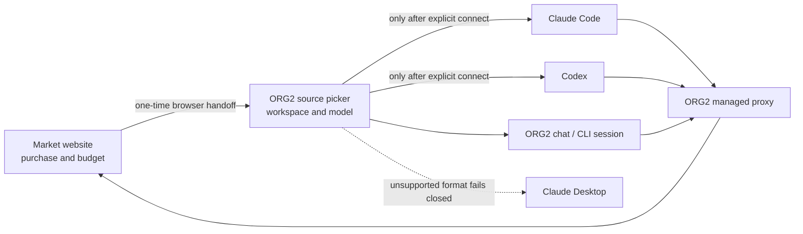

# Market in ORG2: product and module boundary

Market purchases are workspaces that ORG2 can use as execution sources. They are
not Key Vault accounts, provider profiles, or a fourth external application.
Users install ORG2 once; they do not install a separate Market client, copy a
Base URL, paste a token, or run a setup command.

## User flow

1. The buyer signs in and purchases a service on the Market website.
2. Opening ORG2 signs in or reuses the same Market identity and refreshes the
   buyer's active purchases.
3. Purchased workspaces appear beside the buyer's other sources in ORG2's
   existing source/model picker. A user can switch workspaces there without
   returning to the website.
4. ORG2 starts the selected session and resolves the workspace credential for
   every request through its local bridge.

The website owns purchase, budget, and billing. ORG2 owns local selection,
execution, and recovery. The model and project directory remain choices in the
destination experience; browser authorization must not add an extra workspace
or model confirmation page.

## App connections

**App connections** is an optional adapter for people who want to use a
purchased workspace from Claude or Codex outside ORG2's own chat surface. It is
not where purchases are discovered or managed.

- The normal ORG2 source picker remains the authoritative workspace selector.
- External-app wiring follows the selected Market workspace and configures only
  the chosen application.
- The application list should present one Claude product surface with its
  supported Claude Code and Claude Desktop states, plus one Codex surface.
- Existing provider profiles and imported credentials stay in their normal
  advanced account-management path. Market purchases must not be injected into
  those provider-profile grids.

ORG2 must remain running in the background while an external application uses a
Market workspace. The client talks to ORG2's local bridge, which resolves fresh
authorization on demand. Quitting ORG2 stops that route and the client must show
a clear instruction to reopen ORG2; the client must never receive a long-lived
Market credential that lets it continue independently.

Disconnecting an external application restores that application's previous
configuration. It does not sign the user out of Market and does not delete a
purchase, entitlement, workspace grant, or ORG2 source. Revocation and purchase
state remain Market operations.

### Final UI shape

The normal source picker owns daily workspace selection:

```text
Model / source
├─ My OpenAI account
├─ My Anthropic account
├─ Market · Code review service
└─ Market · Batch refactor service
```

App connections shows the current Market source and the optional external
applications that may follow it. It does not repeat the source or model picker:

```text
App connections

Current Market workspace
  Code review service · claude-sonnet
  Change this from ORG2's normal model/source picker.

Claude
  Claude Code       Original setup          [Follow ORG2]
  Claude Desktop    Unsupported version      (disabled)

Codex
  Codex             Following ORG2           [Open] [Stop following]

▸ Advanced provider settings and credential import
```



## Module ownership

| Part                                                       | Owner                                           |
| ---------------------------------------------------------- | ----------------------------------------------- |
| Listings, price, wallet, purchase and entitlement          | Market website and backend                      |
| Market identity, purchase discovery and credential renewal | ORG2 Market module                              |
| Workspace selection and native ORG2 sessions               | Existing ORG2 source/model and session flows    |
| Optional Claude/Codex wiring, conflict checks and restore  | Existing App connections adapters               |
| Per-request local routing                                  | ORG2 local bridge and dynamic credential source |

Code is split between `src/features/MarketConnect`,
`src-tauri/crates/market-connect`, and the host adapters under
`src-tauri/src/market_connection`. The generic proxy consumes a registered
dynamic credential source; it must not special-case Market by name.

## Security and lifecycle invariants

- Client configuration stores only non-secret selection metadata and a local
  bridge address/token. Refresh credentials stay in the operating-system
  credential store and never cross frontend IPC.
- A workspace entitlement and selected model are validated before a route is
  created. Unknown, expired, or revoked sources fail without falling back to a
  personal provider account.
- A running session owns its routing generation. Switching the visible source
  does not silently rebind an older session.
- Normal close may leave ORG2 running in the background. Full quit stops Market
  routing and releases owned local state without deleting conversation history.
- External configuration restore is conflict-aware and must not overwrite a
  configuration the user changed after ORG2 applied its adapter.

## Release and acceptance boundary

The production website must remain compatible with the released ORG2 protocol.
A protocol marker or successful build proves only structural compatibility; it
does not prove installed-client behavior, provider authorization, payment, or
inference.

Release acceptance requires, at minimum:

- purchase discovery and source switching in the main ORG2 application;
- real requests through each supported model family;
- background-window use and clear full-quit failure/recovery;
- optional Claude/Codex connect, reopen, conflict and restore behavior;
- credential expiry/renewal, remote revocation and restart recovery;
- signed macOS and Windows packages where the capability is advertised.

Seller account enrollment remains a website flow. It may use ORG2 as a native
authorization receiver only when the released protocol supports that handoff;
it is separate from the buyer's workspace-selection and external-app wiring
flow.
